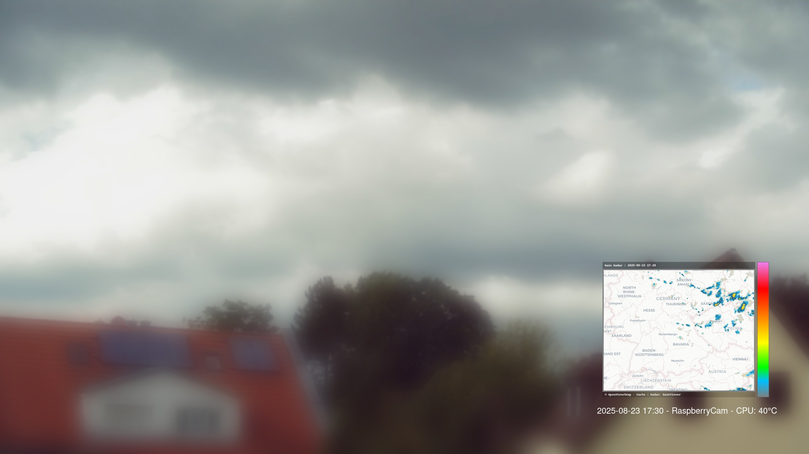

# Raspberry Pi Webcam Weather Classification

This project enables capturing webcam images, automatic archiving, fetching weather data from OpenWeatherMap, and classifying the weather situation.  
All results are saved as JSON files and additionally organized in a `classified` folder to prepare training data for Machine Learning.

## Features

### 📸 Image Capture & Archiving
- Capture a webcam image via a shell script (`02_take_webcam_picture.sh`).
- Current image is stored in `jpg/current/IMG_4903.jpg`.
- All captures are archived into `jpg/old/<timestamp>.jpg`.

### 🌦️ Weather Data (OpenWeatherMap)
- New module `openweathermap.py` fetches current weather data based on the configuration (`config.local.json`).
- API key & city (`Laufamholz,de`) are loaded from the config file.
- Timeout handling: if the API does not respond, an error message is written into the JSON object.

### ☁️ Classification (Rule-based)
- New module `classify.py` creates a simple English classification from OWM data:
  - `clouds.all` → cloud coverage (clear, few, scattered, broken, overcast)
  - `weather.id` → phenomenon (rain, snow, thunderstorm, drizzle, fog, …)
  - `wind.speed` → if ≥ 17 m/s, `(storm)` is added
- Output:
  - `classification`: compact string, e.g. `"overcast clouds with rain"`
  - `classification_detail`: structured details (`coverage`, `phenomenon`, `storm`, `wind_speed_ms`, `clouds_percent`, `weather_id`).

### 📂 JSON Management
- For each image, a JSON file is generated and stored under `json/<timestamp>.json`.
- JSON contains:
  - Path to the archived image (`old_path`)
  - Weather data from OpenWeatherMap
  - Classification (string + structured details)
- Saved nicely formatted with `indent=4`.

### 🤖 Classified Folder (for ML)
- JPG + JSON are additionally copied into  
  `jpg/classified/<classification>/`
- New subfolders are automatically created if not existing.
- Result: automatically organized training dataset (images + metadata).

## Project Structure

```
jpg/
 ├─ current/       → latest image (IMG_4903.jpg)
 ├─ old/           → archive of all images with timestamp
 ├─ classified/    → automatically sorted images & JSON by classification
json/              → JSON files matching each image
modules/           → Python modules (capture, upload, openweathermap, classify)
main.py            → entry point
```

## Example Output (JSON)

```json
{
    "old_path": "jpg/old/IMG_4903_20250817_131645.jpg",
    "coord": { "lon": 11.1622, "lat": 49.4663 },
    "weather": [
        {
            "id": 803,
            "main": "Clouds",
            "description": "broken clouds",
            "icon": "04d"
        }
    ],
    "clouds": { "all": 75 },
    "wind": { "speed": 4.63, "deg": 310 },
    "classification": "broken clouds",
    "classification_detail": {
        "coverage": "broken clouds",
        "phenomenon": null,
        "storm": false,
        "wind_speed_ms": 4.63,
        "clouds_percent": 75,
        "weather_id": 803
    }
}
```

---

## Sample Image (broken clouds)

Here’s a sample capture from the Raspberry Pi webcam.  
The bottom of the image is blurred to protect my neighbours’ privacy.



---

## Installation & Usage

1. Clone or extract the project.  
2. Adjust configuration in `config.local.json` (OpenWeatherMap API key, upload settings).  
3. Install dependencies:
   ```bash
   pip install requests
   ```
4. Run the main script:
   ```bash
   python3 main.py
   ```

---

## License
This project is licensed under the [MIT License](LICENSE).

